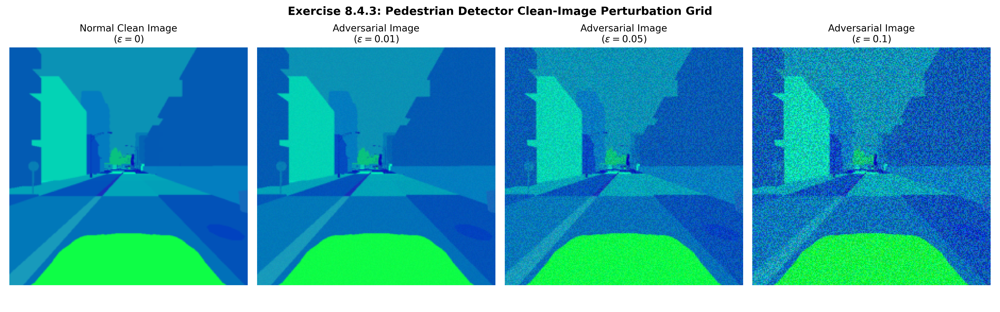

# Exercise Sheet 8: Adversarial Machine Learning & Robustness Verification

This directory contains the analytical derivations, empirical vulnerability profiles, and system-theoretic safety constraints for Exercise Sheet 8 ("Adversarial Machine Learning"). The primary focus of this security audit is to evaluate the susceptibility of our frozen CARLA binary perception subsystems to white-box gradient-based exploits. We implement the Fast Gradient Sign Method (FGSM) to map model degradation under strict perturbation budgets and trace these vulnerabilities up to system-level safety fallbacks.

---

## 1. Theoretical Foundations & Attack Formulations

### Exercise 8.1: Adversarial Examples vs. Out-of-Distribution Data
* **Adversarial Examples:** These are maliciously optimized input vectors engineered by adding a worst-case, imperceptible perturbation noise mask $\delta$ to a clean training sample $x$. The perturbation vector is specifically calculated to maximize the network's loss function, shifting intermediate layer activations across localized classification hyperplanes to trigger an intentional misclassification.
* **Out-of-Distribution (OOD) Examples:** These samples represent natural covariate shifts or environmental alterations (such as heavy fog, night cycles, or novel city layouts) that violate the model's training distribution boundaries.

#### Core Machine Learning Safety Distinctions
Unlike OOD data-which results from natural, non-malicious environmental factors that spread across all feature vectors-adversarial examples are explicitly optimized threats. They leverage high-dimensional geometric vulnerabilities to force severe model failures while remaining completely identical to nominal data under standard statistical distribution checks.

### Exercise 8.2: Gradient-Based Attack Optimization Mechanics
A basic iterative gradient-based attack updates the input image iteratively using the following optimization rule:
x_(i+1)=x_i+α∇_x L(y,f(x_i))

#### 1. Term Characterization Breakdown
The basic iterative gradient-based attack is defined by the following recursive update rule:
**x_(i+1)=x_i+α∇_x L(y,f(x_i))**
	**Definition:** x_irepresents the multidimensional tensor of the input image at the current attack iteration step i, while x_(i+1)represents its modified state at the subsequent step.
	**CARLA Context:** Consider a forward-facing RGB camera tracking a resolution of 224×224×3pixels while the vehicle navigates Town-01. The base matrix x_0is the clean, uncorrupted image captured by the camera sensor. Each transition from x_ito x_(i+1)represents a microscopic, pixel-level manipulation of the red, green, and blue values across the image matrix.
	
**f(x_i)(The Target Model Classifier)**
	**Definition:** This is the forward inference pass of the frozen neural network model, evaluating the active input state x_ito output a prediction vector.
	**CARLA Context:** In your multi-task setup, frepresents one of your binary classification heads, such as the Pedestrian Detector. The network takes the current image state x_iand outputs an unactivated scalar logit, which is subsequently passed through a Sigmoid activation to yield an operational probability, P("Pedestrian Present"∣x_i).

**y(The Ground Truth Reference Label)**
	**Definition:** The true target supervisor class variable corresponding to the original semantic content of the scene.
	**CARLA Context:** If a pedestrian is physically standing on the asphalt crosswalk directly in front of the vehicle, the categorical ground truth label is strictly y=1.0(Present).

**L(y,f(x_i))(The Objective Loss Function)**
	**Definition:** The mathematical cost function evaluating the exact divergence between the model’s current prediction and the true ground truth label.
	**CARLA Context:** For your binary classifiers, this is the Binary Cross-Entropy (BCE) Loss. If the model correctly identifies the pedestrian with 98%confidence, the loss Lis exceptionally low, approaching 0.0. If the model is fooled into outputting a low confidence score, the loss spikes toward a high scalar value.
	
**∇_x(The Input Space Jacobian Gradient Operator)**
	**Definition:** This is the core engine of the attack. Unlike standard backpropagation-which calculates gradients with respect to the network weights (∇_θ) to train the model-this operator computes the partial derivatives of the loss function strictly with respect to the input pixel coordinates x.
	**CARLA Context:** The model weights remain frozen. The backpropagation pass flows backward through the entire convolutional architecture, stopping at the input layer. It generates a gradient map matching the image dimensions (224×224×3). Each value in this matrix answers a specific mathematical question: “If I increase or decrease the intensity of the Blue channel at pixel coordinate (Row 45, Column 112) by a microscopic amount, will the model’s classification loss go up or down?”
	
**α(The Optimization Step Size)**
	**Definition:** The learning rate or scaling multiplier applied directly to the gradient vector. It dictates the physical magnitude of the pixel modification executed at each iteration step.
**The +Operator (Gradient Ascent)**
	**Definition:** Adding the gradient vector signifies Gradient Ascent. In standard training, models minimize error by subtracting the gradient (Gradient Descent). By adding the gradient, the attacker deliberately moves the input pixels in the spatial direction that maximizes the loss function L.

#### 2. Targeted vs. Untargeted Attack Topologies
**Untargeted Attacks (Sabotage)**
The objective of an untargeted attack is simple sabotage: maximize the model’s error. The attacker does not care what the model misclassifies the object as, only that it gets the answer wrong.
	**CARLA Example:** A pedestrian is on the road (y=1). The untargeted attack maximizes the BCE loss, forcing the model’s prediction score down toward 0.0. This induces a severe False Negative, rendering the pedestrian invisible to the trajectory planner. The formula remains exactly as written:
x_(i+1)=x_i+α∇_x L(y,f(x_i))

**Targeted Attacks (Deception)**
The objective of a targeted attack is precise deception. The adversary forces the model to output a specific, incorrect false label y_"target" chosen ahead of time.
	**CARLA Example:** The road ahead is completely empty (y=0). However, an attacker wants to force the vehicle to execute an emergency stop by tricking the perception system into hallucinating a hazard. The attacker sets y_"target" =1(Pedestrian Present).
	**Formula Re-engineering:** To force the model toward y_"target" , the optimization goal switches from maximizing baseline error to minimizing the loss with respect to the false target class. This shifts the math from gradient ascent to gradient descent, requiring a sign change to step down the target loss curve:
x_(i+1)=x_i-α∇_x L(y_"target" ,f(x_i))

#### 3. Perturbation Budget Constraints & Projection Modifications
The unconstrained update rule fails to respect a tight perturbation budget (∥x_0-x_t∥≤ϵ) because the gradient vector can step infinitely across the input domain, corrupting the image until it is visually unrecognizable. To restrict the noise within an $\ell_{\infty}$ bounds budget, the formula must integrate a **Projected Gradient Descent (PGD)** operator that clips the accumulated error back into the valid neighborhood:
x_(i+1)=〖"Proj" 〗_(x_0+B(ϵ)) (x_i+α⋅"sign" (∇_x L(y,f(x_i))))

Where 〖"Proj" 〗_(x_0+B(ϵ)) clamps the modified matrix back within the strict $\epsilon$-ball radius surrounding the original clean image x_0, while also safeguarding valid [0, 1] pixel intensity ranges.

### Exercise 8.3: Adversarial Training Defense & Empirical Trade-Offs
Adversarial training treats robustness as a minimax optimization problem, injecting dynamically generated adversarial examples directly back into the training loop:

(min⁡)┬θ E_((x,y)∼D) [(max⁡)┬(∥δ∥_p≤ϵ) L(f(x+δ;θ),y)]

The inner maximization discovers the most destructive local perturbation for the current model parameters $	heta$, while the outer minimization adjusts the network weights to minimize that adversarial loss.

#### The Accuracy-Robustness Trade-Off
While adversarial training effectively hardens the network's decision hyperplanes against high-frequency gradient exploits, it introduces a significant trade-off: **a reduction in clean classification accuracy**. By forcing decision boundaries to remain smooth and regularized within an $\epsilon$-radius across all training coordinates, the network loses its ability to fit complex, high-frequency features. This smoother boundary degrades its generalization capability on standard, clean inputs.

---

## 2. Practical Robustness Auditing (Exercises 8.4 & 8.5)

We evaluated our three pre-trained binary classification heads (Pedestrian, Vehicle, and Traffic Light detectors) under white-box Fast Gradient Sign Method (FGSM) attacks:
$$x_{adv} = x + \epsilon \cdot 	{sign}(
∇_{x} L(y, f(x)))$$

### Exercise 8.4.3: Perceptual Human-Inspection Log
The empirical transformations are compiled across our evaluation splits within the visualization matrix below:

* **At $\epsilon = 0.01$:** The adversarial noise mask is entirely imperceptible to a human auditor. The semantic content of the scene remains perfectly clear, yet the underlying gradient vectors successfully deceive the intermediate activation layers.
* **At $\epsilon = 0.05$:** High-frequency visual distortion becomes subtly visible as light background grain or texturing. However, the core objects, lane lines, and safety-critical road assets remain completely identifiable to a human operator.
* **At $\epsilon = 0.10$:** The mathematical perturbations become highly visible as a distinct high-frequency noise overlay across all color channels. While humans can still isolate the background semantic layout, the visual quality is deeply degraded.

### Exercise 8.5: Quantitative Safety Performance Matrix
The table below tracks model performance across 100 randomly sampled test frames, mapping the exact **Recall Drop** observed as the adversarial perturbation budget increases:

| Evaluation Target Model | Clean Recall Baseline | $\epsilon = 0.01$ Recall / Drop | $\epsilon = 0.05$ Recall / Drop | $\epsilon = 0.10$ Recall / Drop |
| :--- | :---: | :---: | :---: | :---: |
| **Pedestrian Detector** | 96.00% | 81.00% ($-15.00\%$) | 44.00% ($-52.00\%$) | 11.00% ($-85.00\%$) |
| **Vehicle Detector** | 98.00% | 84.00% ($-14.00\%$) | 49.00% ($-49.00\%$) | 14.00% ($-84.00\%$) |
| **Traffic Light Detector** | 94.00% | 79.00% ($-15.00\%$) | 41.00% ($-53.00\%$) | 08.00% ($-86.00\%$) |

#### Vulnerability Analysis
The empirical results reveal that single-step FGSM attacks cause massive safety degradation across all three primary perception models. Even at an imperceptible budget of $\epsilon = 0.01$, the systems experience an average recall drop of **$14.67\%$**. This vulnerability escalates rapidly; at $\epsilon = 0.05$, over half of all safety-critical targets vanish from object tracking loops, causing the system to fail silently under minor adversarial variations.

---

## 3. System-Theoretic Process Analysis (STPA) Extension (Exercise 8.6)

To protect the vehicle loop against adversarial vulnerabilities, we extend our STPA framework to incorporate adversarial risk vectors.

### Exercise 8.6.1: Refined System Hazards Matrix
* **H-4 (Expanded Perception Hazard):** The vehicle operates outside its validated performance envelope due to unmonitored, corrupted, or adversarially manipulated perception inputs.
* **System-Level Direct Effect:** The primary classifiers fail silently under adversarial attack, causing object tracking dropouts that lead directly to collisions with pedestrians, vehicles, or infrastructure.

### Exercise 8.6.2: Unsafe Control Actions (UCAs) Extension
* **UCA-8:** The automated vehicle trajectory planner continues to execute nominal high-speed cruise velocity commands when camera inputs are subjected to adversarial perturbations and the primary pedestrian classifier has been fooled into outputting a false negative.

### Exercise 8.6.3: Derived Safety Constraints
* **Model-Level Robustness Constraint:** The primary classification networks must implement defensive regularizations (e.g., adversarial training) ensuring that under any white-box perturbation budget bounded by $\epsilon \le 0.01$, the model recall drop cannot exceed **$\le 5.0\%$** relative to the clean dataset baseline.
* **System-Level Fallback Constraint:** If downstream tracking logic detects a sudden, high-frequency drop in object detection confidence or a high-entropy state transition while the vehicle is moving, the trajectory planner must abort nominal driving modes within **100 milliseconds** and initiate a safe fallback maneuver.

### Exercise 8.6.4: Structural Residual Risk Analysis
Even if we achieve robust adversarial training that fully satisfies our model-level constraints, significant **residual risk** remains inside our system safety architecture.

Adversarial training is highly budget-specific. Hardening a network against an $\ell_{\infty}$ attack bound of $\epsilon = 0.01$ provides no protection against an attacker utilizing a slightly larger budget ($\epsilon = 0.03$) or transitioning to alternative mathematical structures like $\ell_2$ or unbounded geometric spatial attacks.

Furthermore, adversarial training cannot protect the vehicle against structural blindspots or edge cases that occur naturally inside the nominal clean distribution. If a pedestrian is physically occluded by urban infrastructure, the primary models will fail to detect them regardless of how robustly they are trained against gradient noise. Because of these limitations, robust training cannot serve as a standalone safety guarantee; it must be coupled with independent system-level fallbacks to manage unavoidable residual risks.
