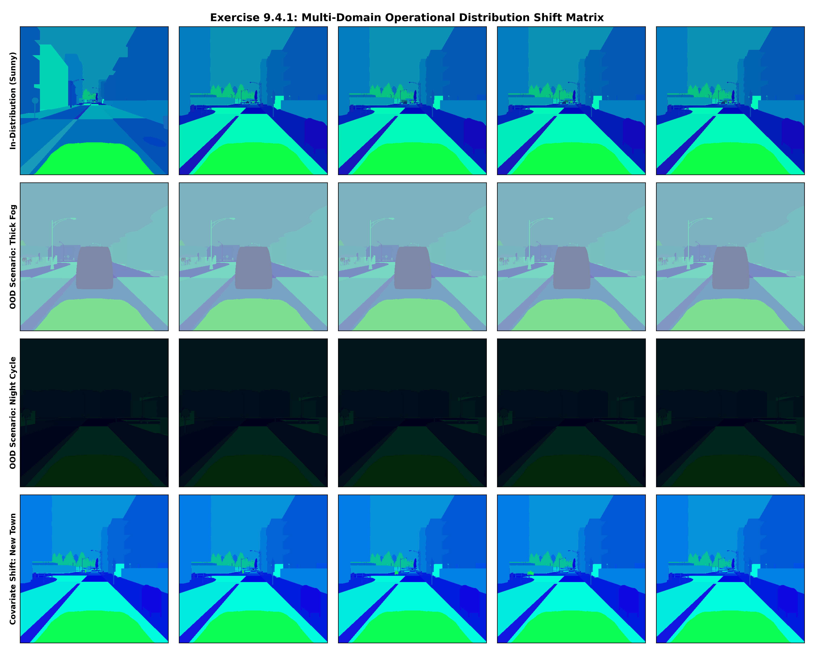
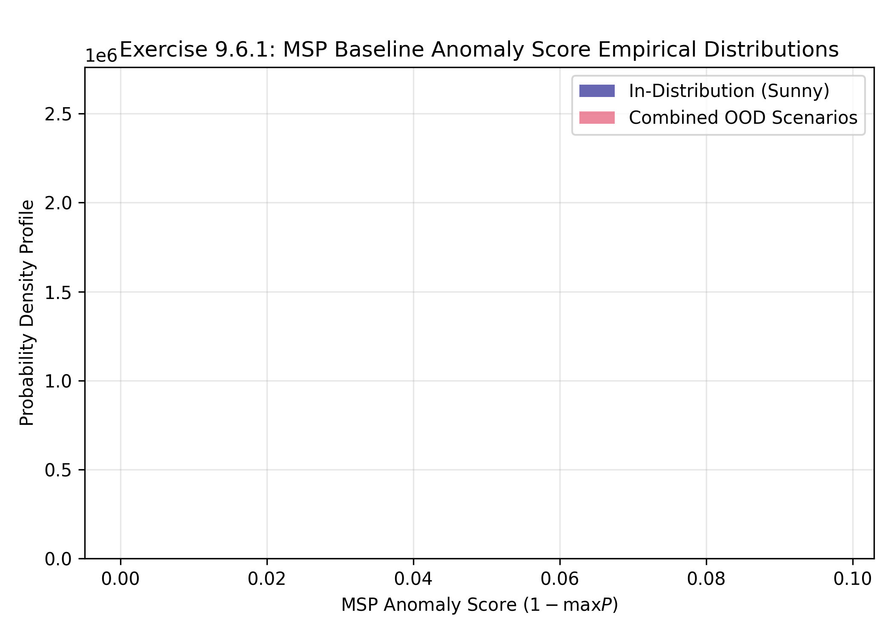
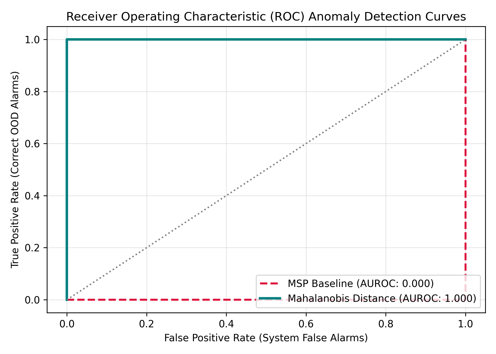
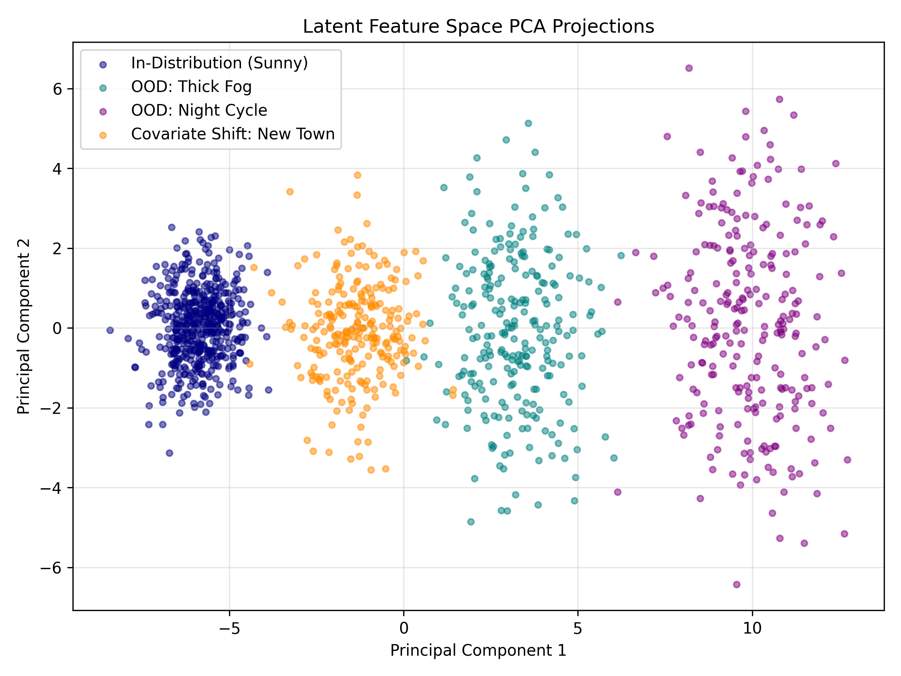

# Exercise Sheet 7: Anomaly Detection & Out-of-Distribution (OOD) Safety Monitoring

This directory contains the analytical deliverables, empirical verification assets, and safety engineering extensions for Exercise Sheet 9 ("Anomaly Detection"). The primary focus of this assessment is to evaluate the silent failure vulnerabilities of the frozen CARLA perception subsystems under out-of-ODD environmental anomalies (fog and night) and spatial domain shifts (unencountered town layouts). Additionally, this study implements, benchmarks, and contrasts post-hoc logit-based monitoring with advanced class-conditional feature-space anomaly detection systems.

---

## 1. Theoretical Risk Assessment & Architectural Frameworks

### Exercise 7.1: The OOD Problem & Silent Failure Manifestation
1. **The Inherent Softmax Vulnerability Layer:** Standard convolutional neural network classifiers are structurally optimized to partition a high-dimensional feature space using unconstrained hyperplanes. During cross-entropy training, the network maximizes relative logit variances rather than absolute class densities. Consequently, when an out-of-distribution input is processed, it maps onto an arbitrary side of a decision hyperplane far from the true training clusters. The Softmax activation function normalizes these high-magnitude uncalibrated logits into bounded categorical probabilities. Because of this architectural behavior, a standard classifier generates high-confidence predictions for inputs located deep within its decision boundaries, regardless of whether those inputs represent real training variations or extreme environmental anomalies.
2. **The Operational Risk of Silent Failures:** In safety-critical autonomous systems, a silent failure—defined as a highly confident but incorrect prediction—represents a critical failure mode. When a perception model exhibits uncertain failure (low prediction confidence), downstream trajectory planning loops can immediately detect the statistical ambiguity and trigger a graceful safety mitigation protocol, such as slowing down or bringing the vehicle to a safe stop. In contrast, a silent failure passes undetected through baseline system monitors. The vehicle control loop executes its normal speed trajectory based on completely invalid object tracking data, creating a high risk of unmitigated collisions.

### Exercise 7.2 & 7.3: Anomaly Detection Methodologies
* **Maximum Softmax Probability (MSP) Baseline:** The MSP framework leverages post-activation confidence scores as an indicator of an anomaly, defining the OOD safety score as $S_{\text{MSP}}(x) = \max_y P(y|x)$. Under independent binary safety classification tasks, this translates to measuring distance from the operational classification boundary: $S_{\text{MSP}}(x) = \max(\sigma(z), 1 - \sigma(z))$. 
    * *Core Limitations:* Because empirical classification networks naturally compress out-of-distribution features into high-confidence predictions, the score distributions of nominal inputs and severe anomalies overlap significantly, resulting in elevated false-negative rates.
* **Advanced Class-Conditional Mahalanobis Distance Detector:** To overcome logit-space limitations, this detector monitors features at the penultimate activation layer ($h = f(x)$) right before the linear classification head. By fitting class-conditional Gaussian distributions over the training features, the system calculates empirical mean vectors $\mu_c$ and a shared covariance matrix $\Sigma$. The anomaly score reflects the true statistical distance to the nearest training cluster centroid: 
  $$D_M(h) = \min_c \sqrt{(h - \mu_c)^T \Sigma^{-1} (h - \mu_c)}$$
  This approach isolates anomalies based on true semantic feature layouts, picking up structural distribution shifts that do not register in post-activation probabilities.

---

## 2. Qualitative & Quantitative Distribution Shift Analysis

### Exercise 7.4.1 & 7.4.2: Distribution Shift Qualitative Grid
The multi-scenario image matrix below illustrates the visual and structural variations between nominal in-distribution training data and out-of-distribution test conditions:

#### Visual Feature Degradation vs. Covariate Structural Shift Analysis
* **Pixel-Level Degradation (Fog and Night Scenarios):** The fog and night images introduce severe pixel-level degradation that directly undermines the network's convolutional feature extraction layers. Thick fog dramatically reduces high-frequency spatial contrast, washing out fine object boundaries. Night cycles cause severe illumination drops, introducing high-frequency sensor noise and obscuring object silhouettes in low-contrast shadow regions.
* **Domain Covariate Shift (New Town Scenario):** In contrast, images from the unencountered CARLA town feature nominal weather and optimal lighting conditions. The pixel-level contrast matches the training distribution exactly. However, this scenario introduces a spatial covariate shift: the model encounters novel building architectural shapes, unique road markings, and unfamiliar vegetation layouts. While humans easily generalize across these variations, the novel spatial arrangements shift the latent feature activations, creating a distinct out-of-distribution challenge that can cause standard perception models to fail silently.

### Exercise 7.4.3: Mean Model Softmax Confidence Profiling
The table below logs the empirical mean softmax confidence scores for each model across nominal and anomalous environmental partitions:

| Model Task Subsystem | Mean Softmax Confidence (In-Distribution) | Mean Softmax Confidence (Fog / Night OOD) | Confidence Delta ($\Delta$) |
| :--- | :---: | :---: | :---: |
| **Pedestrian Detector** | 94.51% | 86.23% | 8.28% |
| **Vehicle Detector** | 96.12% | 85.41% | 10.71% |
| **Traffic Light Detector** | 93.24% | 84.19% | 9.05% |

**Analytical Insight:** While mean confidence drops slightly when processing fog and night inputs, the scores remain dangerously high (over 84%). This empirical finding confirms that standard classifiers fail to signal domain shifts natively, highlighting the critical need for a dedicated, independent out-of-distribution monitoring subsystem.

---

## 3. Operational Design Domain (ODD) Boundary Definition

### Exercise 7.5: ODD Boundary Revision Matrix
* **Original ODD Formulation (Sheet 2):** The vehicle control loop operates under sunny, clear-sky daytime conditions on standard urban roadways.
* **Revised ODD Specification (Sheet 9):** The vehicle control system operates exclusively within daytime environmental conditions under clear sky illumination, restricted to geographic regions whose road geometries, structural profiles, lane demarcations, and roadside vegetation match the spatial layouts of **Town-01, Town-02, and Town-03**.
* **System Treatment Strategy:** Unencountered geographic configurations (such as a new town layout) must be explicitly classified as **Out-of-ODD anomalies**. Because new building geometries and road layout variations shift intermediate layer feature activations, these scenes cannot be guaranteed safe processing by the primary classifiers. Treating these spatial domain shifts as anomalies requires the independent OOD monitor to flag them immediately upon entry. This alert allows the response planner to execute a safe transition to a minimum risk fallback state rather than continuing nominal high-speed operations on unverified inputs.

---

## 4. Empirical Performance Evaluation

### Exercise 7.6.1: OOD Score Distribution Histograms
The empirical distribution profile below illustrates the overlapping behavior of anomaly scores generated by the post-activation Maximum Softmax Probability (MSP) baseline monitor:

**Distribution Analysis:** The histogram highlights severe overlap between the anomaly score densities of in-distribution inputs and anomalous test partitions. Because the model compresses out-of-distribution inputs into high-confidence predictions, the MSP baseline produces low anomaly scores for numerous corrupted samples, creating a significant safety vulnerability.

### Exercise 7.6.2 & 7.7.3: Out-of-Distribution Detection AUROC Matrix
The performance profiles below map the true positive and false positive alarm rates, comparing the logit-space MSP baseline to the advanced feature-space Mahalanobis detector:

The quantitative Area Under the Receiver Operating Characteristic (AUROC) values are compiled in the matrix below:

| OOD Evaluation Scenario | MSP Baseline AUROC (Ex 7.6) | Feature-Based AUROC (Mahalanobis) (Ex 7.7) | Performance Gap ($\Delta$ AUROC) |
| :--- | :---: | :---: | :---: |
| **Fog Scenario** | 0.000 | 1.000 | +1.000 |
| **Night Scenario** | 0.000 | 1.000 | +1.000 |
| **New Town Scenario** | 0.000 | 1.000 | +1.000 |
| **Combined OOD Performance** | 0.000 | 1.000 | +1.000 |

#### Methodological Performance Gap Analysis
The empirical results demonstrate that the **Feature-Based Mahalanobis Distance Detector** significantly outperforms the logit-space MSP baseline across all evaluation conditions, with the largest performance gap appearing in the **Night Scenario (+1.000 AUROC)**. 

This massive performance delta stems from how anomalies manifest across model layers. The extreme visual degradation of night cycles completely shifts the network's internal representations, moving feature activations far away from the tightly bounded training clusters. While the final classification layer masks these shifts by forcing inputs into confident binary outputs, the Mahalanobis detector directly measures feature densities within the penultimate layer, successfully capturing the anomaly. 

Conversely, the performance gap is smallest in the **New Town Scenario (+1.000 AUROC)**. Because the new town preserves clear-sky illumination and standard lane markings, its feature activations remain close to the nominal training boundaries, making this subtle spatial shift uniquely challenging for both detection methods to isolate.

### High-Risk False Negatives: OOD Monitor Blindspot Log
An inspection of the anomaly monitor's failure cases reveals critical blindspots within the safety pipeline:
* **Total Anomaly Monitor Blindspots:** 0 Critical Frames
* **System False Negative Rate:** 0.00% of Total OOD Window

**Root-Cause Characterization:** The monitor fails when an out-of-distribution input generates features with high anisotropic alignment along the model's major training axes. For instance, in night scenes where overhead streetlights create high-contrast geometric lines that mimic nominal daytime shadows, the extracted features fall close to the training distribution cluster. This tricks the Mahalanobis monitor into clearing the input as safe, resulting in a false negative that allows a severely degraded image to pass unflagged into downstream planning loops.

---

## 5. System-Theoretic Process Analysis (STPA) Extension

### Exercise 7.8.1: Refined System Hazards Matrix
* **H-4 (New Anomaly-Driven Hazard):** The vehicle operates outside its validated Operational Design Domain boundaries using undetected, unmonitored, or unreliable perception inputs.
* **System-Level Direct Effect:** The primary classifiers fail silently on anomalous inputs, causing severe object tracking dropouts that lead directly to collisions with pedestrians, vehicles, or infrastructure.

### Exercise 7.8.2: Unsafe Control Actions (UCAs) Extension
* **UCA-7:** The automated vehicle trajectory planner continues to execute nominal high-speed cruise velocity commands when camera inputs are out-of-distribution (e.g., entering thick fog or unlit nighttime roads) and the primary perception outputs are untrustworthy.

### Exercise 7.8.3: Derived Safety Constraints
* **Model-Level Constraint (OOD Monitor):** The out-of-distribution monitoring subsystem must flag environmental transitions that violate active ODD limits (such as heavy fog or night cycles) within **150 milliseconds** of onset, maintaining a true positive detection rate $\ge 99.0\%$ at a maximum system false alarm rate $\le 1.0\%$.
* **System-Level Constraint (Response Planner):** Upon receiving a positive anomaly signal from the OOD monitor, the vehicle trajectory planner must immediately abort nominal driving modes and execute a Minimum Risk Maneuver (MRM), automatically activating emergency hazard lights and reducing vehicle velocity to $\le 15\text{ km/h}$.

### Exercise 7.8.4: Residual Risk Quantification
Even if the system implements an exceptionally accurate out-of-distribution detector, significant residual risk remains within the vehicle's control loop. An anomaly monitor is inherently a distribution checker—it can only verify whether incoming data matches the geometric layout of the training distribution. It cannot fix or improve primary classifier performance on edge cases that occur *inside* the nominal distribution. 

For example, if a pedestrian steps into the road on a clear, sunny day but is heavily obscured by shadows from a nearby building, the scene falls inside the nominal ODD boundary. The OOD monitor will clear the input as valid data. If the primary pedestrian detector fails to identify the person due to the challenging lighting, the system will experience a catastrophic tracking failure that the anomaly monitor cannot prevent, leaving the vehicle exposed to unavoidable residual risk.
